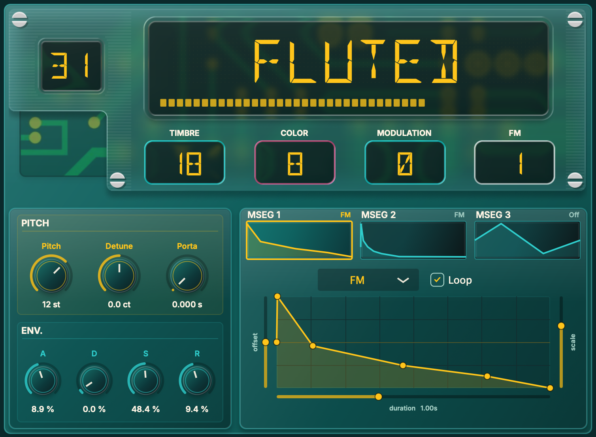

# Macro OSC

Macro OSC is a compact software synthesizer built around the Mutable Instruments Braids macro oscillator engine. It brings Braids-style oscillator models into a focused JUCE instrument with direct pitch, timbre, color, modulation, FM, envelope, and multi-stage modulation controls. Choose an oscillator model, shape its core tone from the main panel, then use the MSEG modulators to add movement.



## Highlights

- Braids macro oscillator DSP with a broad range of digital oscillator models.
- VST3 plugin and standalone app targets.
- Rack-style interface with draggable value displays.
- Direct control over model, timbre, color, modulation amount, FM amount, pitch, detune, glide, and ADSR envelope shape.
- Three editable MSEG slots for reusable movement/rhythmic modulation.
- MSEG destinations for model, timbre, color, modulation, and FM.
- Loopable MSEG shapes with amount, offset, rate, and curve editing.

## Interface

The main panel is centered on the oscillator. Drag the model display, Timbre, Color, Modulation, and FM readouts to adjust the core sound. Pitch, detune, portamento, and amp envelope controls sit below the oscillator section for quick performance shaping.

The lower modulation area provides three MSEG slots. Select a slot, choose its destination, then edit amount, offset, rate, loop state, and curve shape. Add points directly in the graph, drag points to reshape the modulation, and double-click interior points to remove them.

## Formats

Macro OSC builds as:

- VST3 instrument plugin
- Standalone desktop app

## Development

Macro OSC is a CMake-based JUCE project. Configure it with a JUCE checkout, then build the generated project for your platform:

```sh
cmake -S . -B build -DJUCE_DIR=/path/to/JUCE
cmake --build build --config Debug
```

Build products are written under the local `build/` directory.

## License

Except where noted below, Macro OSC source code and first-party assets are
licensed under the GNU Affero General Public License version 3 or later. See
`LICENSE`.

Third-party source and asset notices are listed in `THIRD_PARTY_NOTICES.md`.
That includes the Mutable Instruments Braids/stmlib sources under
`Source/ThirdParty/Mutable/`, the bundled Inter and DSEG fonts, and the external
JUCE dependency.
